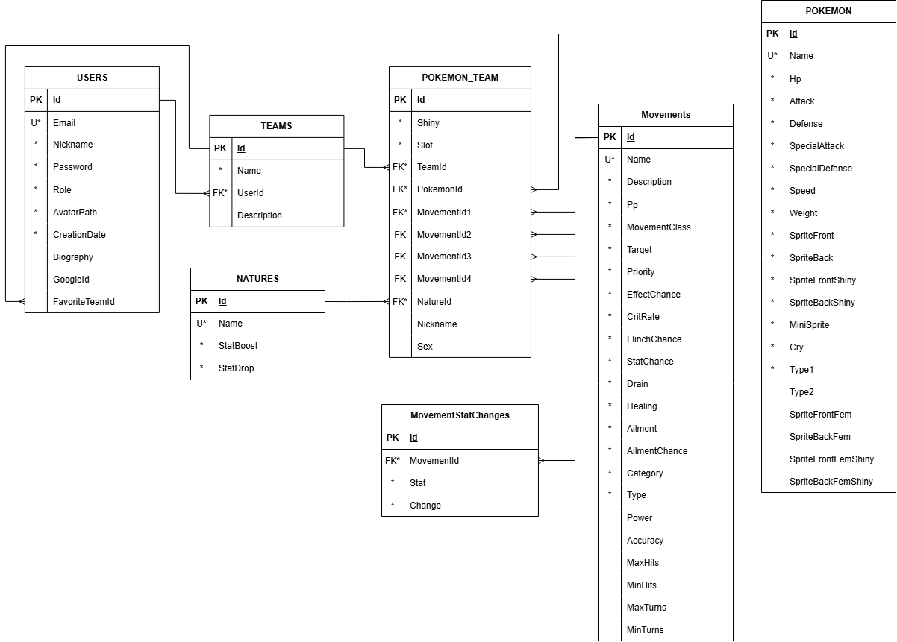

# 📄 Base de Datos - Project Pokémon

## Introducción

La base de datos de Project Pokémon ha sido diseñada siguiendo un modelo relacional normalizado, con el objetivo de almacenar de forma eficiente la información de usuarios, equipos Pokémon, especies Pokémon, movimientos y naturalezas.

El sistema permite gestionar tanto la personalización de equipos por parte de los usuarios como la información necesaria para la simulación de combates en tiempo real.

## Modelo Entidad-Relación

La siguiente imagen muestra el diagrama relacional completo de la base de datos:

## Tablas principales

### USERS

Almacena la información de los usuarios registrados en la aplicación.

| Campo          | Descripción                     |
| -------------- | ------------------------------- |
| Id             | Identificador único del usuario |
| Email          | Correo electrónico              |
| Nickname       | Nombre visible del usuario      |
| Password       | Contraseña cifrada              |
| Role           | Rol del usuario (admin o user)  |
| AvatarPath     | Avatar seleccionado             |
| CreationDate   | Fecha de creación               |
| Biography      | Biografía del perfil            |
| GoogleId       | Identificador de Google OAuth   |
| FavoriteTeamId | Equipo favorito                 |

Relaciones:

* Un usuario puede tener varios equipos.
* Un usuario puede marcar un equipo como favorito.

### TEAMS

Representa los equipos creados por los usuarios.

| Campo       | Descripción              |
| ----------- | ------------------------ |
| Id          | Identificador del equipo |
| Name        | Nombre del equipo        |
| Description | Descripción del equipo   |
| UserId      | Usuario propietario      |

Relaciones:

* Un equipo pertenece a un usuario.
* Un equipo contiene varios Pokémon.

### POKEMON_TEAM

Tabla intermedia que almacena los Pokémon que forman parte de un equipo y su configuración individual.

| Campo         | Descripción                |
| ------------- | -------------------------- |
| Id            | Identificador              |
| TeamId        | Equipo al que pertenece    |
| PokemonId     | Pokémon seleccionado       |
| NatureId      | Naturaleza                 |
| MovementId1-4 | Movimientos equipados      |
| Nickname      | Apodo personalizado        |
| Shiny         | Indica si es variocolor    |
| Sex           | Sexo del Pokémon           |
| Slot          | Posición dentro del equipo |

Relaciones:

* Pertenece a un equipo.
* Referencia una especie Pokémon.
* Referencia una naturaleza.
* Puede tener hasta cuatro movimientos.

### POKEMON

Contiene la información base de cada especie Pokémon disponible.

| Campo                              | Descripción      |
| ---------------------------------- | ---------------- |
| Id                                 | Identificador    |
| Name                               | Nombre           |
| Hp                                 | Puntos de salud  |
| Attack                             | Ataque           |
| Defense                            | Defensa          |
| SpecialAttack                      | Ataque especial  |
| SpecialDefense                     | Defensa especial |
| Speed                              | Velocidad        |
| Weight                             | Peso             |
| Type1                              | Tipo principal   |
| Type2                              | Tipo secundario  |
| SpriteFront / SpriteBack           | Sprites normales |
| SpriteFrontShiny / SpriteBackShiny | Sprites shiny    |
| SpriteFrontFem / SpriteBackFem     | Variantes hembra |

Actualmente la aplicación utiliza únicamente Pokémon de primera generación, manteniendo las mecánicas competitivas modernas.

### MOVEMENTS

Contiene toda la información de los movimientos Pokémon disponibles.

| Campo         | Descripción               |
| ------------- | ------------------------- |
| Id            | Identificador             |
| Name          | Nombre del movimiento     |
| Description   | Descripción               |
| Type          | Tipo                      |
| Category      | Física, Especial o Estado |
| Power         | Potencia                  |
| Accuracy      | Precisión                 |
| Pp            | Puntos de poder           |
| Priority      | Prioridad                 |
| EffectChance  | Probabilidad de efecto    |
| CritRate      | Índice de crítico         |
| Healing       | Curación                  |
| Drain         | Robo de vida              |
| Ailment       | Estado alterado           |
| AilmentChance | Probabilidad de estado    |

Estos datos son utilizados durante el cálculo de daño y la resolución de turnos de combate.

### MOVEMENTSTATCHANGES

Almacena los cambios de estadísticas asociados a determinados movimientos.

| Campo      | Descripción            |
| ---------- | ---------------------- |
| Id         | Identificador          |
| MovementId | Movimiento asociado    |
| Stat       | Estadística modificada |
| Change     | Variación aplicada     |

Ejemplo:

* Danza Espada → Ataque +2.
* Gruñido → Ataque -1.

### NATURES

Contiene las naturalezas disponibles para los Pokémon.

| Campo     | Descripción           |
| --------- | --------------------- |
| Id        | Identificador         |
| Name      | Nombre                |
| StatBoost | Estadística aumentada |
| StatDrop  | Estadística reducida  |

Las naturalezas modifican las estadísticas finales del Pokémon durante los combates.

## Relaciones principales

- Un usuario puede crear múltiples equipos.
- Cada equipo pertenece a un único usuario.
- Un equipo puede contener varios Pokémon.
- Cada Pokémon del equipo puede tener una naturaleza.
- Cada Pokémon del equipo puede tener hasta cuatro movimientos.
- Un movimiento puede modificar estadísticas mediante registros en MovementStatChanges.

## Tecnologías utilizadas

La base de datos ha sido desarrollada utilizando:

- SQLite para el desarrollo y MariaDB para el despliegue
- Entity Framework Core
- ASP.NET Core
- Patrón Repository
- Patrón Unit of Work

## Objetivo del diseño

El modelo de datos se ha diseñado para:

- Evitar redundancia de información.
- Facilitar la escalabilidad futura del proyecto.
- Permitir la gestión eficiente de equipos Pokémon.
- Mantener la integridad referencial entre entidades.
- Soportar el sistema de combate competitivo implementado en la aplicación.
